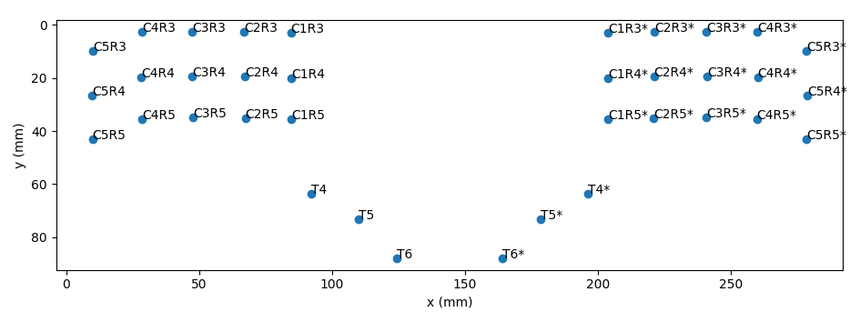
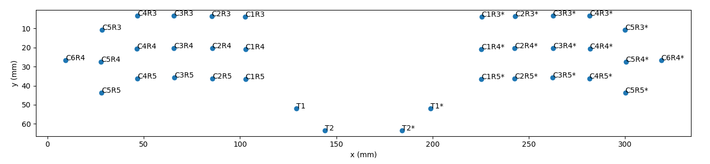
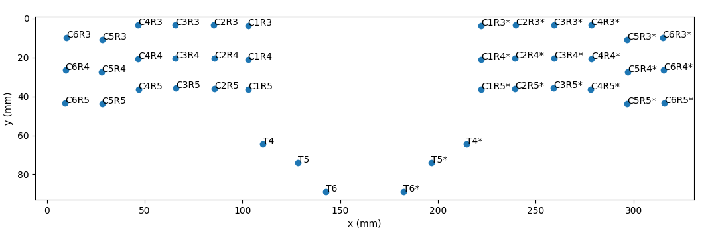
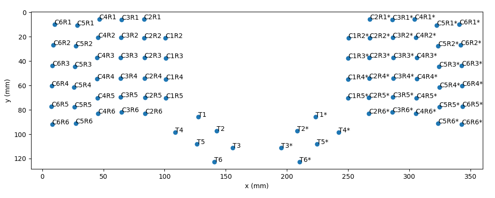
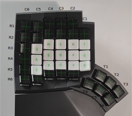

# glove80-key-coordinates

This repository holds the key 2d coordinates of the [Glove80 keyboard](https://www.moergo.com/).


> [!TIP]
> You can make custom layouts with [show_coordinates.py](show_coordinates.py)
>
> If you're planning to use [dariogoetz/keyboard_layout_optimizer](https://github.com/dariogoetz/keyboard_layout_optimizer), you may use [coords_klo_format.py](coords_klo_format.py)

# XY coordinates of the keys

<table>
<tr>
<td>
<h2> 36 key layout</h2>


<details>
<summary>
    <b>Click here to view the coordinates</b>
</summary>

<pre><code>
{'C1R3': (84.512044288, 3.0541335040000064),
 'C1R3*': (203.934441728, 3.0541335040000064),
 'C1R4': (84.558070528, 20.12562150400001),
 'C1R4*': (203.888415488, 20.12562150400001),
 'C1R5': (84.594650368, 35.702834944),
 'C1R5*': (203.851835648, 35.702834944),
 'C2R3': (66.996153088, 2.7075397120000133),
 'C2R3*': (221.450332928, 2.7075397120000133),
 'C2R4': (67.268462848, 19.610846464000005),
 'C2R4*': (221.17802316799998, 19.610846464000005),
 'C2R5': (67.413637888, 35.32335846400002),
 'C2R5*': (221.032848128, 35.32335846400002),
 'C3R3': (47.47361612799999, 2.5458795520000166),
 'C3R3*': (240.972869888, 2.5458795520000166),
 'C3R4': (47.33003084799999, 19.439605504000014),
 'C3R4*': (241.11645516800002, 19.439605504000014),
 'C3R5': (47.684347648, 35.017894143999996),
 'C3R5*': (240.762138368, 35.017894143999996),
 'C4R3': (28.406751999999997, 2.6239498240000074),
 'C4R3*': (260.039734016, 2.6239498240000074),
 'C4R4': (28.26335488000001, 19.81383654400001),
 'C4R4*': (260.183131136, 19.81383654400001),
 'C4R5': (28.545021183999992, 35.547376384),
 'C4R5*': (259.901464832, 35.547376384),
 'C5R3': (10.0, 10.0),
 'C5R3*': (278.446486016, 10.0),
 'C5R4': (9.568298751999997, 26.70873318400001),
 'C5R4*': (278.87818726399996, 26.70873318400001),
 'C5R5': (9.873859071999995, 42.90782694400002),
 'C5R5*': (278.57262694400004, 42.90782694400002),
 'T4': (92.262492928, 63.632038144000006),
 'T4*': (196.183993088, 63.632038144000006),
 'T5': (109.983017728, 73.24805862400001),
 'T5*': (178.463468288, 73.24805862400001),
 'T6': (124.223243008, 88.022435584),
 'T6*': (164.223243008, 88.022435584)}
</code></pre>
</details>
</td>
</tr>
<tr>
<td>
<h2> 36 keys: 2 upper row thumbs + 6th col pinky</h2>

<details>
<summary>
    <b>Click here to view the coordinates</b>
</summary>

<pre><code>
{'C1R3': (102.75593497599999, 3.8827601920000063),
 'C1R3*': (225.51203609599997, 3.8827601920000063),
 'C1R4': (102.801961216, 20.95424819200001),
 'C1R4*': (225.46600985599997, 20.95424819200001),
 'C1R5': (102.838541056, 36.531461632),
 'C1R5*': (225.42943001599997, 36.531461632),
 'C2R3': (85.240043776, 3.5361664000000133),
 'C2R3*': (243.02792729599997, 3.5361664000000133),
 'C2R4': (85.512353536, 20.439473152000005),
 'C2R4*': (242.75561753599996, 20.439473152000005),
 'C2R5': (85.657528576, 36.15198515200002),
 'C2R5*': (242.61044249599996, 36.15198515200002),
 'C3R3': (65.717506816, 3.3745062400000165),
 'C3R3*': (262.55046425599994, 3.3745062400000165),
 'C3R4': (65.573921536, 20.268232192000013),
 'C3R4*': (262.69404953599997, 20.268232192000013),
 'C3R5': (65.92823833599999, 35.846520831999996),
 'C3R5*': (262.339732736, 35.846520831999996),
 'C4R3': (46.650642688, 3.4525765120000074),
 'C4R3*': (281.61732838399996, 3.4525765120000074),
 'C4R4': (46.50724556800001, 20.64246323200001),
 'C4R4*': (281.760725504, 20.64246323200001),
 'C4R5': (46.78891187199999, 36.376003072),
 'C4R5*': (281.47905919999994, 36.376003072),
 'C5R3': (28.243890688, 10.828626688),
 'C5R3*': (300.02408038399994, 10.828626688),
 'C5R4': (27.812189439999997, 27.53735987200001),
 'C5R4*': (300.45578163199997, 27.53735987200001),
 'C5R5': (28.117749759999995, 43.73645363200002),
 'C5R5*': (300.150221312, 43.73645363200002),
 'C6R4': (9.44171008, 26.562545152000013),
 'C6R4*': (318.82626099199996, 26.562545152000013),
 'T1': (129.204472576, 52.010662912000015),
 'T1*': (199.06349849599997, 52.010662912000015),
 'T2': (144.13398553599998, 63.37894451200002),
 'T2*': (184.13398553599998, 63.37894451200002)}
</code></pre>
</details>
</td>
</tr>
<tr>
<td>
<h2>42 key layout</h2>

<details>
<summary>
    <b>Click here to view the coordinates</b>
</summary>

<pre><code>
{'C1R3': (102.75593497599999, 3.8827601920000063),
 'C1R3*': (222.178332416, 3.8827601920000063),
 'C1R4': (102.801961216, 20.95424819200001),
 'C1R4*': (222.132306176, 20.95424819200001),
 'C1R5': (102.838541056, 36.531461632),
 'C1R5*': (222.09572633599998, 36.531461632),
 'C2R3': (85.240043776, 3.5361664000000133),
 'C2R3*': (239.694223616, 3.5361664000000133),
 'C2R4': (85.512353536, 20.439473152000005),
 'C2R4*': (239.42191385599997, 20.439473152000005),
 'C2R5': (85.657528576, 36.15198515200002),
 'C2R5*': (239.27673881599998, 36.15198515200002),
 'C3R3': (65.717506816, 3.3745062400000165),
 'C3R3*': (259.21676057599996, 3.3745062400000165),
 'C3R4': (65.573921536, 20.268232192000013),
 'C3R4*': (259.360345856, 20.268232192000013),
 'C3R5': (65.92823833599999, 35.846520831999996),
 'C3R5*': (259.006029056, 35.846520831999996),
 'C4R3': (46.650642688, 3.4525765120000074),
 'C4R3*': (278.283624704, 3.4525765120000074),
 'C4R4': (46.50724556800001, 20.64246323200001),
 'C4R4*': (278.427021824, 20.64246323200001),
 'C4R5': (46.78891187199999, 36.376003072),
 'C4R5*': (278.14535551999995, 36.376003072),
 'C5R3': (28.243890688, 10.828626688),
 'C5R3*': (296.69037670399996, 10.828626688),
 'C5R4': (27.812189439999997, 27.53735987200001),
 'C5R4*': (297.122077952, 27.53735987200001),
 'C5R5': (28.117749759999995, 43.73645363200002),
 'C5R5*': (296.816517632, 43.73645363200002),
 'C6R3': (10.0, 10.0),
 'C6R3*': (314.934267392, 10.0),
 'C6R4': (9.44171008, 26.562545152000013),
 'C6R4*': (315.492557312, 26.562545152000013),
 'C6R5': (9.294281727999994, 43.43128883200001),
 'C6R5*': (315.639985664, 43.43128883200001),
 'T4': (110.506383616, 64.460664832),
 'T4*': (214.427883776, 64.460664832),
 'T5': (128.226908416, 74.07668531200001),
 'T5*': (196.707358976, 74.07668531200001),
 'T6': (142.467133696, 88.851062272),
 'T6*': (182.467133696, 88.851062272)}
</code></pre>
</details>
</td>
</tr>
<tr>
<td>
<h2> 80 key layout</h2>

<details>
<summary>
    <b>Click here to view the coordinates</b>
</summary>

<pre><code>
{'C1R2': (100.69926630399999, 21.032394496000002),
 'C1R2*': (250.250979584, 21.032394496000002),
 'C1R3': (101.042923264, 37.738322944),
 'C1R3*': (249.907322624, 37.738322944),
 'C1R4': (101.088949504, 54.809810944),
 'C1R4*': (249.86129638399998, 54.809810944),
 'C1R5': (101.125529344, 70.387024384),
 'C1R5*': (249.82471654399998, 70.387024384),
 'C2R1': (83.11106790400001, 5.552362239999994),
 'C2R1*': (267.839177984, 5.552362239999994),
 'C2R2': (83.39285478400001, 21.001029375999998),
 'C2R2*': (267.557391104, 21.001029375999998),
 'C2R3': (83.527032064, 37.391729152),
 'C2R3*': (267.42321382399996, 37.391729152),
 'C2R4': (83.79934182400001, 54.295035903999995),
 'C2R4*': (267.150904064, 54.295035903999995),
 'C2R5': (83.94451686400001, 70.007547904),
 'C2R5*': (267.00572902399995, 70.007547904),
 'C2R6': (84.036707584, 82.902813184),
 'C2R6*': (266.913538304, 82.902813184),
 'C3R1': (64.873195264, 6.091243263999992),
 'C3R1*': (286.077050624, 6.091243263999992),
 'C3R2': (64.517434624, 20.826080511999997),
 'C3R2*': (286.43281126399995, 20.826080511999997),
 'C3R3': (64.004495104, 37.23006899200001),
 'C3R3*': (286.945750784, 37.23006899200001),
 'C3R4': (63.860909824, 54.123794944000004),
 'C3R4*': (287.089336064, 54.123794944000004),
 'C3R5': (64.215226624, 69.70208358399998),
 'C3R5*': (286.735019264, 69.70208358399998),
 'C3R6': (64.764569344, 82.05924198400001),
 'C3R6*': (286.185676544, 82.05924198400001),
 'C4R1': (46.58329062400001, 5.616441087999995),
 'C4R1*': (304.36695526399996, 5.616441087999995),
 'C4R2': (45.666085888000005, 20.861559040000003),
 'C4R2*': (305.28416, 20.861559040000003),
 'C4R3': (44.937630976, 37.308139264),
 'C4R3*': (306.012614912, 37.308139264),
 'C4R4': (44.79423385600001, 54.498025984),
 'C4R4*': (306.156012032, 54.498025984),
 'C4R5': (45.075900159999996, 70.231565824),
 'C4R5*': (305.874345728, 70.231565824),
 'C4R6': (45.645273088, 83.10246246400001),
 'C4R6*': (305.3049728, 83.10246246400001),
 'C5R1': (28.489714432000007, 10.638006783999991),
 'C5R1*': (322.46053145599996, 10.638006783999991),
 'C5R2': (27.30167910400001, 27.512465151999997),
 'C5R2*': (323.64856678399997, 27.512465151999997),
 'C5R3': (26.530878976000004, 44.68418943999999),
 'C5R3*': (324.419366912, 44.68418943999999),
 'C5R4': (26.099177728, 61.392922624),
 'C5R4*': (324.85106815999995, 61.392922624),
 'C5R5': (26.404738048, 77.592016384),
 'C5R5*': (324.54550783999997, 77.592016384),
 'C5R6': (27.329669632000005, 91.217910784),
 'C5R6*': (323.620576256, 91.217910784),
 'C6R1': (10.0, 10.0),
 'C6R1*': (340.950245888, 10.0),
 'C6R2': (8.992245760000003, 26.728445439999994),
 'C6R2*': (341.958000128, 26.728445439999994),
 'C6R3': (8.286988288000003, 43.85556275199999),
 'C6R3*': (342.66325759999995, 43.85556275199999),
 'C6R4': (7.728698368000003, 60.418107904),
 'C6R4*': (343.22154752, 60.418107904),
 'C6R5': (7.581270015999998, 77.286851584),
 'C6R5*': (343.36897587199996, 77.286851584),
 'C6R6': (8.102605312000001, 92.05320294399999),
 'C6R6*': (342.847640576, 92.05320294399999),
 'T1': (127.491460864, 85.86622566400001),
 'T1*': (223.45878502399998, 85.86622566400001),
 'T2': (142.420973824, 97.234507264),
 'T2*': (208.529272064, 97.234507264),
 'T3': (155.475122944, 111.06636390399999),
 'T3*': (195.475122944, 111.06636390399999),
 'T4': (108.793371904, 98.31622758399999),
 'T4*': (242.156873984, 98.31622758399999),
 'T5': (126.51389670399999, 107.93224806399999),
 'T5*': (224.436349184, 107.93224806399999),
 'T6': (140.754121984, 122.70662502399998),
 'T6*': (210.196123904, 122.70662502399998)}
</code></pre>
</details>
</td>
</tr>
<tr>
<td>
</table>

# How this data was produced

The source of the data is a photograph, taken (approximately) directly above the keyboard with 90 degree angle. Since the keyboard is really three dimensional, it is not easy to get a good 2d image of it (it's curved both horizontally and vertically).



The following measurements were made (corresponding to the lines in the hidden "measurements" layer):
- R3-horizontal: 109.0 mm
- R4-horizontal: 109.5 mm
- C4-vertical: 90.0 mm

This information was used to translate the picture coordinates into real-world coordinates (millimeters). The scale is:

```
scale =  0.768 (mm/inkscape_mm)
```

See `calculate_scale.py` for details. Then, `show_coordinates.py` was used to calculate the coordinates of each key center on a two dimensional plane. The top left key center coordinates were fixed to (10, 10) mm and the separation between the sides was set to 40 mm. To change the keys included in `show_coordinates.py`, edit the `SELECTED` variable.